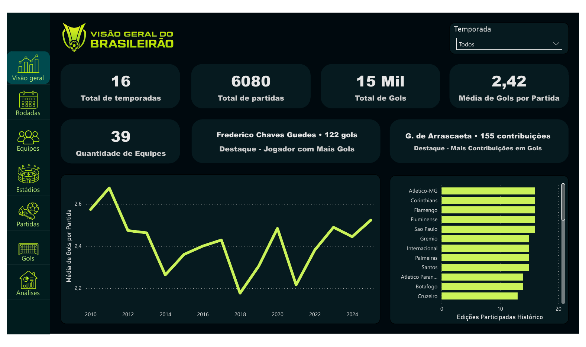
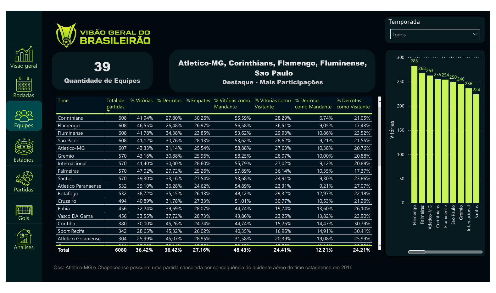
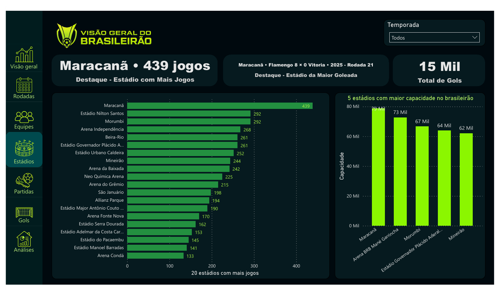
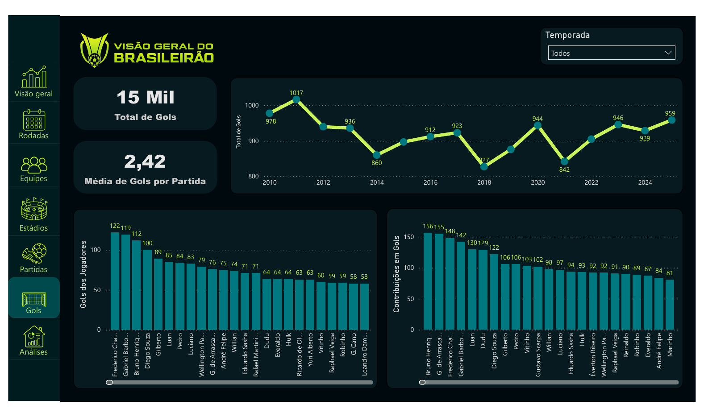
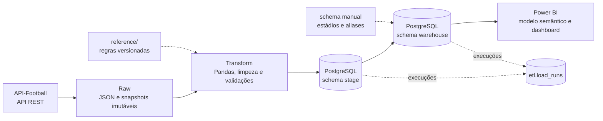
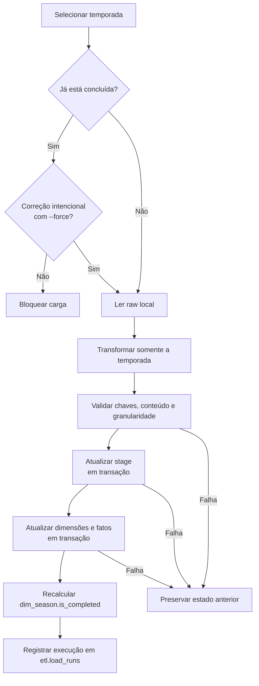
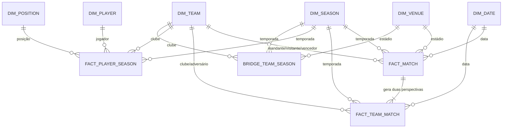

# Football Analytics BI


Pipeline de Engenharia de Dados e Business Intelligence que transforma dados da
API-Football em um Data Warehouse dimensional no PostgreSQL e em um dashboard
analítico no Power BI para o Campeonato Brasileiro Série A.

O projeto cobre o ciclo completo do dado: extração, preservação do raw,
transformação, qualidade, carga completa e incremental, modelagem dimensional,
auditoria e visualização.

## Dashboard


O relatório reúne análises de temporadas, rodadas, clubes, estádios, partidas e
jogadores. Os filtros permitem explorar o histórico de **2010 a 2025**.

- [Visualizar o dashboard em PDF](powerbi/brasileirao.pdf)
- [Baixar o arquivo do Power BI](powerbi/brasileirao.pbix)

<details>
<summary>Ver capturas do dashboard</summary>

### Visão geral



### Equipes



### Estádios



### Gols



</details>

## Resultados do projeto

| Indicador | Volume |
|---|---:|
| Temporadas | 16 |
| Partidas | 6.080 |
| Registros de clube por partida | 12.160 |
| Estatísticas de jogador por temporada | 15.128 |
| Jogadores | 5.393 |
| Clubes | 39 |
| Nomes de estádios consolidados | 194 nomes em 79 locais canônicos |

## Stack e competências demonstradas

| Área | Tecnologias e práticas |
|---|---|
| Engenharia de Dados | Python, Pandas, APIs REST, JSON, ETL completo e incremental |
| Banco de Dados | PostgreSQL, SQL, SQLAlchemy, modelagem dimensional e índices |
| Qualidade e operação | validações de granularidade, transações, auditoria e testes |
| Business Intelligence | Power BI, modelo semântico, métricas e visualização de dados |
| Governança | raw imutável, linhagem, regras versionadas e curadoria reproduzível |

## Arquitetura



| Camada | Responsabilidade |
|---|---|
| **Extract** | Consulta a API, valida as respostas e preserva o JSON original. |
| **Raw** | Mantém o dado imutável para auditoria e reprocessamento. |
| **Transform** | Padroniza tipos e nomes, remove duplicidades e calcula métricas. |
| **Stage** | Armazena tabelas amplas e próximas da origem. |
| **Warehouse** | Aplica chaves, relacionamentos e regras de negócio para análise. |
| **Power BI** | Entrega indicadores e navegação analítica ao usuário final. |

## Pipeline incremental

A atualização é isolada por temporada. Temporadas em andamento aceitam novos
snapshots; temporadas concluídas ficam protegidas contra alterações acidentais.



Snapshots recebem um marcador `_SUCCESS.json` apenas após uma extração completa.
Diretórios incompletos são ignorados, e as cargas de `stage` e `warehouse`
utilizam transações para evitar estados parciais.

## Modelo dimensional



| Tipo | Tabela | Granularidade |
|---|---|---|
| Dimensão | `dim_date` | uma linha por data |
| Dimensão | `dim_team` | uma linha por clube |
| Dimensão | `dim_venue` | uma linha por estádio canônico |
| Dimensão | `dim_player` | uma linha por jogador |
| Dimensão | `dim_season` | uma linha por temporada |
| Dimensão | `dim_position` | uma linha por posição padronizada |
| Ponte | `bridge_team_season` | um clube em uma temporada |
| Fato | `fact_match` | uma linha por partida |
| Fato | `fact_team_match` | uma linha por clube em cada partida |
| Fato | `fact_player_season` | um jogador por clube e temporada |

Como os identificadores de estádios da API são frequentemente ausentes ou
inconsistentes, o warehouse utiliza uma `venue_key` interna. Um cadastro
persistente de aliases consolida diferentes grafias do mesmo local, enquanto o
nome bruto permanece disponível para auditoria.

## Estrutura do repositório

```text
football-analytics-bi/
├── assets/readme/               # imagens utilizadas nesta apresentação
├── docs/                        # arquitetura e guias operacionais
├── powerbi/                     # relatório .pbix e exportação em PDF
├── reference/                   # regras de negócio e aliases versionados
├── src/football_analytics/
│   ├── config/                  # configurações e constantes
│   ├── extract/                 # API e snapshots raw
│   ├── transform/               # limpeza e transformações
│   ├── load/                    # PostgreSQL, warehouse e auditoria
│   ├── pipeline/                # orquestração por temporada
│   └── utils/                   # funções reutilizáveis
├── tests/                       # testes das correções históricas
├── .env.example
├── requirements.txt
└── README.md
```

## Como executar

### Pré-requisitos

- Python;
- PostgreSQL com um banco chamado `brasileirao`;
- chave da API-Football para uma extração a partir da origem;
- Power BI Desktop apenas para abrir ou editar o arquivo `.pbix`.

### 1. Preparar o ambiente

```bash
git clone https://github.com/carlosagn/football-analytics-bi.git
cd football-analytics-bi

python -m venv venv
source venv/Scripts/activate
pip install -r requirements.txt

cp .env.example .env
```

Preencha no `.env` a chave da API e as credenciais do PostgreSQL. O arquivo
`.env` não é versionado.

### 2. Extrair os dados

```bash
PYTHONPATH=src python -m football_analytics.extract.historical \
  --start-season 2010 \
  --end-season 2025
```

Essa é a única etapa abaixo que acessa a API. Os JSONs já existentes são
reutilizados para permitir retomada da execução.

### 3. Construir o stage e o warehouse

```bash
PYTHONPATH=src python -m football_analytics.transform.all
PYTHONPATH=src python -m football_analytics.load.stage
PYTHONPATH=src python -m football_analytics.load.warehouse
```

### 4. Executar os testes

```bash
PYTHONPATH=src python -m unittest discover -s tests -v
```

Para atualizações de uma única temporada, encerramento de campeonato e
reprocessamentos históricos, consulte o [guia de execução](docs/execucao.md).

## Documentação

| Documento | Conteúdo |
|---|---|
| [Índice da documentação](docs/README.md) | visão geral dos documentos disponíveis |
| [Guia de execução](docs/execucao.md) | comandos por cenário de carga |
| [Pipeline incremental](docs/incremental_pipeline.md) | snapshots, transações e atualização por temporada |
| [Modelo do stage](docs/data_model.md) | tabelas intermediárias e seus grãos |
| [Modelo do warehouse](docs/warehouse_model.md) | dimensões, fatos, chaves e regras analíticas |
| [Carga no PostgreSQL](docs/postgres_load.md) | configuração e reconstrução completa |
| [Inventário da API](docs/api_inventory.md) | endpoints, parâmetros e persistência raw |
| [Correções manuais](docs/manual_data_corrections.md) | fluxo reproduzível de curadoria |
| [Curadoria de estádios](docs/venue_curation.md) | critérios, consolidações e validações |
| [Partidas ausentes](docs/missing_fixtures.md) | investigação e preenchimento de lacunas históricas |
| [Dados de referência](reference/README.md) | regras de negócio versionadas em CSV |

## Decisões e destaques técnicos

- **Raw imutável:** transformações nunca alteram as respostas originais.
- **Reprocessamento determinístico:** as mesmas entradas e regras produzem o
  mesmo resultado na carga completa e na incremental.
- **Granularidade explícita:** cada fato possui um grão definido e validado.
- **Transações:** falhas não deixam uma temporada parcialmente carregada.
- **Curadoria versionada:** correções históricas e aliases são revisáveis no Git.
- **Regra de negócio no warehouse:** métricas reutilizáveis não ficam restritas
  ao dashboard.
- **Auditabilidade:** `etl.load_runs` registra início, fim, status e contagens.

## Aprendizados

- Separar raw, stage e warehouse tornou a investigação de problemas e o
  reprocessamento muito mais simples.
- Uma carga incremental confiável exige mais do que inserir registros: exige
  controle de granularidade, validações e transações por fatia de dados.
- Identificadores fornecidos pela origem nem sempre são adequados como chaves de
  negócio; o caso dos estádios levou à criação de uma chave interna e de um
  registro persistente de aliases.
- Manter correções manuais em arquivos versionados preserva a rastreabilidade sem
  contaminar o dado bruto.
- Centralizar regras no warehouse mantém os resultados consistentes entre
  consultas SQL e o Power BI.

## Próximos passos

- publicar uma versão navegável do relatório no Power BI Service;
- criar um ambiente reproduzível com containers para aplicação e PostgreSQL;
- adicionar integração contínua para testes e validações de qualidade;
- ampliar a cobertura de testes das transformações e cargas incrementais;
- automatizar a atualização e o monitoramento de temporadas em andamento;
- evoluir o projeto para uma execução em nuvem;
- revisar e reduzir as dependências de desenvolvimento.

## Motivação

O futebol foi escolhido por combinar interesse pessoal, grande disponibilidade
de dados e diversas possibilidades analíticas. O resultado é um projeto de
portfólio que demonstra o ciclo completo dos dados em um domínio conhecido e
visualmente rico.

Este é um projeto independente para fins de estudo e portfólio, sem vínculo
oficial com a organização do Campeonato Brasileiro ou com os provedores dos
dados.
